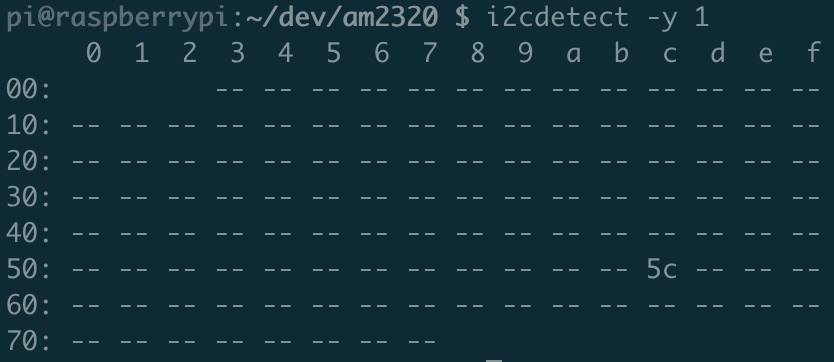

# AM2320 humidity and temperature sensor on a Raspberry Pi

This [forked code](https://github.com/Gozem/am2320) is to access an AM2320 via i2c on Raspberry Pi – in particular, a Raspberry Pi Zero W. 

The AM2320 is a humidity and temperature sensor that communicates using the [Inter-Integrated Circuit (I2C) Protocol](https://learn.sparkfun.com/tutorials/i2c). 

I am using an [AOSONG](https://akizukidenshi.com/download/ds/aosong/AM2320.pdf) sensor, bought from [Pimoroni](https://shop.pimoroni.com/products/digital-temperature-and-humidity-sensor). There isn't a lot of step-by-step guidance for this sensor (unlike, for example, Adafruit sensors that do the same thing), so I hope to be able to provide a bit of helpful guidance here too. 

The intention is to extend the forked repo, to:

- Make it work with Python3.7+
- Provide more detail about how to do the hardware setup
- Ultimately provide a web interface that shows changes over time, etc.

## Getting started

- [Get your RPi running an OS of your choice](https://www.raspberrypi.org/documentation/raspbian/)
- If you go "headless" (no GUI), [this guidance](https://www.raspberrypi.org/documentation/configuration/wireless/wireless-cli.md) on providing WiFi details before first boot might be useful
- [SSH into your RPi](https://www.raspberrypi.org/documentation/remote-access/ssh/)
- Setup your RPi to enable I2C by following these steps (taken from [this guidance](https://www.abelectronics.co.uk/kb/article/1/i2c-part-2---enabling-i-c-on-the-raspberry-pi)):

1. Run `sudo raspi-config`
2. Select `Interface options`
3. Select the `I2C` option and enable it

Then...

1. Run `sudo nano /boot/config.txt`
2. Add the following to the bottom of that file:

`dtparam=i2c_baudrate=400000`  
`core_freq=250` (Only needed for RPi Zero W)

- Run the following to install required packages:

`sudo apt-get update`  
`sudo apt-get install python-smbus python3-smbus python-dev python3-dev i2c-tools`

- Finally, `sudo reboot` (you'll have to reconnect to your RPi once it reboots) to make some of those changes apply.

## Connecting the sensor to your RPi

### Kit list

First things first, you'll need:

- A Raspberry Pi (I'm using the Zero W with a GPIO header)
- An AM2320 sensor (link above to Pimoroni)
- (Optional) A [mini breadboard](https://shop.pimoroni.com/products/colourful-mini-breadboard?variant=264820336)
- (Optional, for use with breadboard) [Male-to-female jumper jerky](https://shop.pimoroni.com/products/jumper-jerky-junior?variant=1076482177)

**Note: you'll need to do some soldering if you don't have a GPIO header on your RPi and if you don't use a breadboard.**

### Connections

As per the [AM2320's documentation](https://akizukidenshi.com/download/ds/aosong/AM2320.pdf), the pins do the following:

| Pin | Name | Description |
| --- | ---- | ----------- |
| 1 | VDD | Power supply(3.1-5.5V) |
| 2 | SDA | Serial data, bidirectional port |
| 3 | GND | Ground |
| 4 | SCL | Serial clock input port (single bus ground) |

The GPIO layout of the Raspberry Pi can be found [on their website](https://www.raspberrypi.org/documentation/usage/gpio/) and is shown below. 

You therefore need to connect (either directly or via the breadboard) in the following configuration, using the diagram below as reference: 

- Pi 3V3 (e.g. to the left of pin 2) to sensor VDD
- Pi GPIO (e.g. pin 3) to sensor SDA
- Pi Ground (e.g. above pin 3 or next to pin 4) to sensor GND
- Pi GPIO (e.g. pin 2) to sensor SCL

### Checking the connection

**Note: This section assumes that you've done/installed the requirements mentioned above.** Do this first if you haven't already. 

With everything connected and switched on and having SSHed into your RPi, run the following:

`i2cdetect -y 1` (if this fails, try `0` instead of `1` in the command)

**Run this twice in quick succession!**

The AM2320 puts itself to sleep when it's not being used actively, so that it doesn't impact the temperature and humidity readings. As such, the first time you run that command you'll get no reading (just dashes) but it will "wake it up". The second you run it will give you the actual reading, which should look something like this: 

If you get a hexadecimal character in one of those areas of the grid, you're good to go! :tada:
